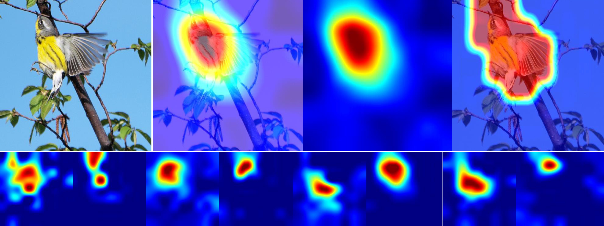

# SCDA_pytorch
This is an unofficial pytorch implement of SCDA ([selective deep descriptors aggregation for fine-grained image retrieval](https://arxiv.org/abs/1604.04994)), which is fully translated from its original matlab version

## requirements
> python                3.6.5  
> numpy 1.16.3  
> pandas 0.24.2  
> torch 1.2.0 + cuda 9.2  
> torchvision 0.4.0 + cuda 9.2  
> scikit-image 0.17.2  
> scikit-learn 0.23.1  
> scipy 1.3.1  
> Pillow 6.1.0  
> matplotlib 3.0.3  
> opencv-contrib-python 4.1.0.25  
> opencv-python         4.1.0.25  
> NVIDIA Geforce GTX 1060

***

**关于pytorch版本的SCDA的说明文档**

首先需要明确的一点是，这是无监督的细粒度图像检索，在数据集的划分上与度量学习的习惯性划分是截然不同的，具体请参照SCDA 原论文
这份代码是对基于matlab版本的SCDA开源代码的翻译版，已经尽可能的以matlab版本的代码的设置为准了，当然可能有所疏漏，所以两份代码都要看，
使用复现的基于pytorch的代码时请仔细检查。

http://www.lamda.nju.edu.cn/code_SCDA.ashx
以上是SCDA matlab版的源码地址

关于运行复现的SCDA：

1. 下载[cub200-2011](http://www.vision.caltech.edu/visipedia/CUB-200-2011.html)数据集
    下载[vgg16](https://download.pytorch.org/models/vgg16-397923af.pth)预训练模型于 .\SCDA_for_LL\model文件夹下

2. 更改 .\SCDA_for_LL\files.py 这个程序的第15行代码为自己下载的CUB 数据集的绝对路径，并运行该程序
       .\SCDA_for_LL\datafile   文件夹下会生成四个json文件，它们与加载数据集有关。

3. 运行 .\SCDA_for_LL\WAOCD\original_SCDA.py  这是对于SCDA的尽可能精确的复现
      提取好的特征也存储在.\SCDA_for_LL\datafile 文件夹下（刚刚看了下，这份代码可以实现的更为简洁，请自行修改）

4. 
    - .\SCDA_for_LL\WAOCD\compute_recall_as_ms.py
    - .\SCDA_for_LL\WAOCD\compute_map_test_batch_circle.py
    - 
      这两个程序用来衡量算法的效果，跑出来的结果一样，两版实现都是正确的

     - .\SCDA_for_LL\WAOCD\compute_recall_as_ms.py 运行的速度相对要快很多 .但是我只实现了Recall@K 
       但是Recall@K是度量学习领域的评价指标，SCDA使用mAP@K作为评价指标（Recall@1等价于mAP@1）
       
       
      - 注：在不同的领域/语境中， 对于recall的定义是有所差异的；具体到度量学习领域，其定义参见 https://arxiv.org/abs/1511.06452

     - .\SCDA_for_LL\WAOCD\compute_map_test_batch_circle.py 运行较慢，但是Recall@K 与mAP@K都实现了
      并且计算的结果自动写入CSV文件，是很便利的；CSV文件在.\SCDA_for_LL\result  文件夹下
      
     - 复现结果如下（因为原始论文的matlab源码使用的是matcovnet工具箱，我复现时用的是pytorch框架。虽然都是用的框架本身提供的vgg16在imagenet_1k上的预训练模型，但是肯定不是一样的参数嘛，所以，与原论文实验结果还是稍有差别的）因为是无监督的实验嘛，并且backbone还是较为古老的vgg16,所以效果一般也可以理解
        |Recall @1|||||
        |---|----|---|---|---|
        |SCDA_avg|SCDA_max|SCDA_max_avg|SCDA+|SCDA_flip+|
        |52.7|53.6|55.9|56.2|58.8|

5. 如果读者想要进行真实的图像检索的话，也是可以的，以下的程序中是一个简易的版本
       .\SCDA_for_LL\WAOCD\img_retrival_original_scda.py  
      从测试集中选定一个query,然后修改程序第77行的query的路径
      第330行左右也是可以修改的，不多说，读者请看源码
       然后这份代码不光是图像检索相关，也对SCDA论文中的可视化的热力图进行了实现，具体请参照源码
       可视化的结果将会存储在.\SCDA_for_LL\retrivial_visualize文件夹下
---   
下图为一个检索示例，左侧为query，右侧为gallery中的top-9的query results

       
---
以上便是全部的介绍
有任何问题请联系：hello_yuhan@163.com

2021.3.21      于涵
